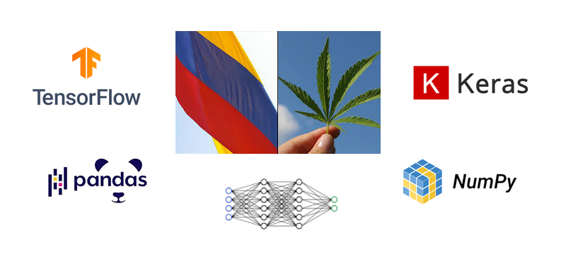

<h1 align="center"> FelipedelosH </h1>
<br>
<h4>ColombianMarijuanaSeizurePredictionML</h4>


:construction: IN CONSTRUCTION :construction:
<br><br>
This project leverages machine learning techniques to predict future marijuana seizures in specific municipalities of Colombia. Utilizing TensorFlow and Keras, the model is trained on historical data to forecast the quantity of marijuana likely to be seized on a future date. The project involves data preprocessing, model construction, training, and evaluation to ensure accurate predictions. This predictive tool aims to assist authorities in planning and resource allocation to combat illegal drug activities.

## :hammer:Funtions:

- `Function 1`: load_data: Function to load and preprocess the dataset.<br>
- `Function 2`: preprocess_data: Function to preprocess data.<br>
- `Function 3`: train_model: Function to train the model.<br>
- `Function 4`: predict_incautation: Function to make a prediction.<br>


## :play_or_pause_button:How to execute a project


Create virtual env:

```
python -m venv myenv
```

Activate virtual env:

```
myenv\Scripts\activate
```

install dependencies:

```
pip install pandas
pip install tensorflow
pip install keras
pip install scikit-learn
```

Excute:

```
set TF_ENABLE_ONEDNN_OPTS=0
python 00-CANNABIS-CO-TensorKeras.py
```

## :hammer_and_wrench:Tech.

- Python
- TensorFlow
- Keras
- Pandas
- numpy
- sklearn

## :warning:Warning.

- If you use windows need excute power shell as administrator and execute commmand: Set-ExecutionPolicy RemoteSigned

## Autor

| [<br><sub>Andrés Felipe Hernánez</sub>](https://github.com/felipedelosh)|
| :---: |